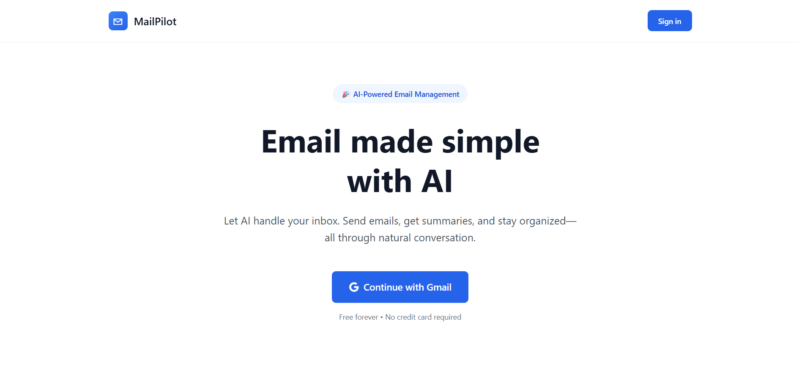
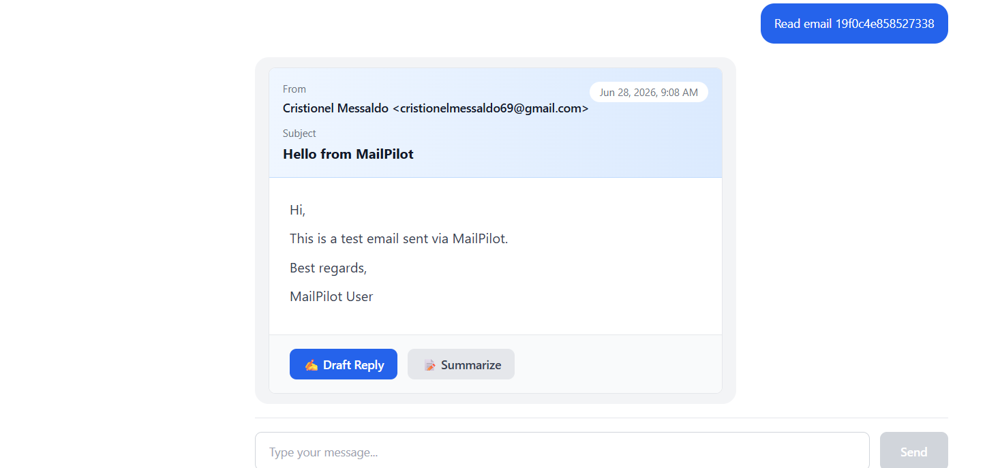
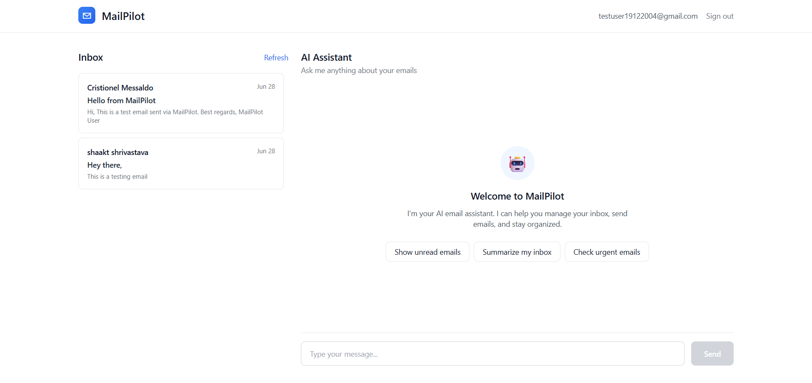
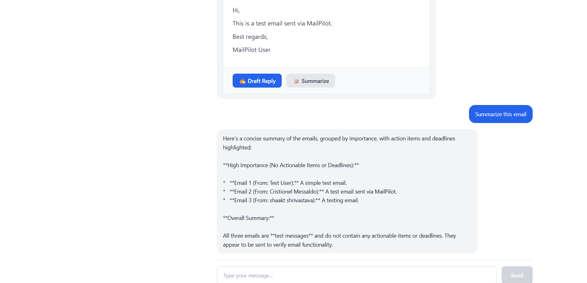

# MailPilot 📧🤖

**AI-powered email management agent that understands natural language and manages your Gmail inbox intelligently.**

   

> **🚀 [Live Demo](https://mail-bot-git-main-shaakt.vercel.app)**

---

## 🌟 What is MailPilot?

MailPilot is an intelligent email assistant that lets you manage your Gmail inbox using natural language. Instead of clicking through menus, simply tell MailPilot what you want:

- *"Show me unread emails from this week"*
- *"Summarize my inbox"*
- *"Send email to john@example.com saying hello"*
- *"Archive all newsletters"*
- *"Find emails with deadlines"*

**Powered by Google Gemini 2.5 Flash AI** + **Gmail API** + **Next.js** + **FastAPI**

---

## ✨ Key Features

🧠 **Natural Language Interface** - Talk to your emails conversationally  
📧 **Smart Email Management** - Read, search, categorize, and organize  
✍️ **AI-Powered Composition** - Draft context-aware replies instantly  
📅 **Intelligent Organization** - Auto-extract deadlines and action items  
⚡ **One-Click Actions** - Archive, star, delete with beautiful UI  
🔄 **Workflow Automation** - Handle complex multi-step tasks  

---

## 📸 Screenshots

<div align="center">
  
### Dashboard


### Email Reading


### Email List Cards


### AI Features


</div>

---

## 🎬 Demo Video

<div align="center">
  
[](./assets/demo/demo-video.mp4)

**[📥 Download Demo Video](./assets/demo/demo-video.mp4)**

</div>

> **� Tip:** GitHub doesn't play videos inline. Click the badge above to download and watch the demo!

---

## 🏗️ Tech Stack

**Frontend:** Next.js 15, TypeScript, Tailwind CSS  
**Backend:** FastAPI (Python), Google Gemini 2.5 Flash  
**Database:** Supabase (PostgreSQL)  
**APIs:** Gmail API, Gemini AI API  

---

## 🚀 Quick Start

### Prerequisites
- Node.js 18+ and Python 3.11+
- [Google Cloud Project](https://console.cloud.google.com) with Gmail API enabled
- [Supabase account](https://supabase.com) (free tier)
- [Gemini API key](https://aistudio.google.com/app/apikey) (free tier)

### Installation

1. **Clone the repository:**
```bash
git clone https://github.com/ShaaktShrivastava/Mail-Bot.git
cd Mail-Bot
```

2. **Set up Google OAuth:**
   - Create OAuth 2.0 credentials in Google Cloud Console
   - Add redirect URI: `http://localhost:3000/auth`
   - Save Client ID and Secret

3. **Create Supabase tables:**
```sql
CREATE TABLE users (
    id UUID PRIMARY KEY DEFAULT gen_random_uuid(),
    email TEXT UNIQUE NOT NULL,
    gmail_token JSONB,
    created_at TIMESTAMP DEFAULT NOW()
);

CREATE TABLE chat_history (
    id UUID PRIMARY KEY DEFAULT gen_random_uuid(),
    user_id TEXT NOT NULL,
    message TEXT NOT NULL,
    response TEXT NOT NULL,
    timestamp TIMESTAMP DEFAULT NOW()
);
```

4. **Configure environment variables:**

**Frontend** (`frontend/.env.local`):
```env
NEXT_PUBLIC_API_URL=http://localhost:8000
NEXT_PUBLIC_GOOGLE_CLIENT_ID=your-client-id
NEXT_PUBLIC_SUPABASE_URL=your-supabase-url
NEXT_PUBLIC_SUPABASE_ANON_KEY=your-supabase-key
```

**Backend** (`backend/.env`):
```env
GEMINI_API_KEY=your-gemini-key
LLM_MODEL=gemini-2.5-flash-lite
GOOGLE_CLIENT_ID=your-client-id
GOOGLE_CLIENT_SECRET=your-client-secret
GOOGLE_REDIRECT_URI=http://localhost:3000/auth
SUPABASE_URL=your-supabase-url
SUPABASE_KEY=your-supabase-key
JWT_SECRET=your-secret-key
```

5. **Install and run:**
```bash
# Frontend
cd frontend
npm install
npm run dev

# Backend (new terminal)
cd backend
pip install -r requirements.txt
uvicorn app:app --reload
```

6. **Open** `http://localhost:3000` and sign in with Gmail!

### Deployment

**Frontend:** Deploy to [Vercel](https://vercel.com) (auto-deploys from GitHub)  
**Backend:** Deploy to [Render](https://render.com) (select `backend` folder)

---

## 💡 Example Commands

```
"Show me emails from last week"
"Summarize my inbox"
"Send email to test@example.com saying Hello!"
"Search for emails about the project"
"Archive email ID xyz123"
"Check urgent emails"
"Generate daily digest"
"Find emails with attachments"
```

---

## 🔐 Security & Privacy

✅ OAuth 2.0 secure authentication  
✅ No password storage  
✅ Encrypted token management  
✅ Your emails stay in your Gmail account  
✅ Open source - transparent codebase  

---

## 🤝 Contributing

Contributions welcome! Feel free to:
- 🐛 Report bugs
- ✨ Suggest features
- 📝 Improve documentation
- 🎨 Enhance UI/UX

---

## 📝 License

MIT License - see [LICENSE](./LICENSE) file for details.

---

## 🙏 Acknowledgments

Built with: Google Gemini AI • Gmail API • Next.js • FastAPI • Supabase

---

**Built with ❤️ for developers tired of email overload**

[⭐ Star this repo](https://github.com/ShaaktShrivastava/Mail-Bot) if you find it useful!
